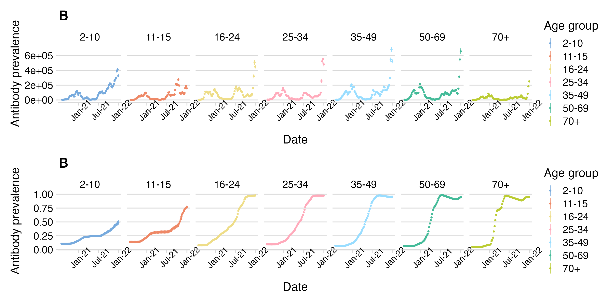

# Age specific forecasts of SARS-CoV-2 infection using contact data

## Pipeline

To run forecasts on historical dates, execute the 'run_forecasts_for_cases.r' or 'run_forecasts_for_infections.r' script and all models will be run for a series of forecast dates. To score the forecasts use the 'score_forecasts()' function which relys on the 'summary_preds' output generated from 'fit_model()' and combined for multiple runs within 'historical_estimates.r'.

## Introduction 
This repository contains code that uses data from the ONS [Covid infection survey]( https://www.ons.gov.uk/peoplepopulationandcommunity/healthandsocialcare/conditionsanddiseases/bulletins/coronaviruscovid19infectionsurveypilot/previousReleases] to generate infections and uses cases directly from the [UK COVID Dashboard](https://coronavirus.data.gov.uk/) and combines with social contact data from the [CoMix](https://www.uhasselt.be/en/aparte-sites-partner-en/epipose/the-comix-study) to make weekly age stratified infection and case incidence forecasts of SARS-COV-2. 

## Methods

The core model is based on the Next Generation Principle. An approximation of epidemic dynamics, which proposes that within a population of well-mixed sub-groups (e.g., age-groups), the incidence of infection in each age-group at time t is given by the incidence of infection in in each age-group the previous generation (t-g) multiplied by an interaction matrix known as the next generation matrix, N(t). We generalised the approach, integrating over the distribution of generation interval by taking the weighted sum of the product of the next generation matrix and the age-stratified vector of infections on dates between t-smax and t-1. 

$$I(t) = \sum\limits_{s=1}^{s_{max}} w(s) \times \text{N}(t-s)\text{I}(t-s)$$

Under the social contact hypothesis, the next generation matrix is calculated by augmenting the contact matrix, C(t), by vectors of age-specific susceptibility (s) and infectiousness (i), where each element, sa and ia, give the specific susceptibility and infectiousness of age group a. Which we inform with data from [CoMix](https://www.uhasselt.be/en/aparte-sites-partner-en/epipose/the-comix-study). 

$$\text{N}(t)=diag(\text{s}) \text{C}(t)diag(\text{i})$$

The scripts compare this model to 3 other NGM: 
1. The same model with no contact data 
2. A model with no interaction between age-groups 
3. The same model but informed by contact data from a different historical contact survey conducted in 2008, [POLYMOD](https://doi.org/10.1371/journal.pmed.0050074)

All models are fit in [stan](https://mc-stan.org/) using the [cmdstanr](https://mc-stan.org/cmdstanr/) package. 

The models are further compared to two nieve baselines
1. With the prediction set as equal to the forecast date 
2. With the prediction set to be an exponential extrapolation of the previous two weeks

Also included is a script that scores and plots information about the performance of the forecasts the script focuses on the CRPS and Bias of the forecasts as calculated using the [scoringutils](https://github.com/epiforecasts/scoringutils) package.

## Example results

Historical forecasts: 

![Fig. II.  A) and B) Infections and cases, respectively, forecast using the CoMix based next generation model and baseline models for each age group (top to bottom) and forecast horizon (left to right). projected infections from the model (bars) and baselines (coloured points) and  black points show infection estimates and reported cases in plots A and B respectively. The estimates being forecast on each axis are shown as solid points; those not being forecast are shown as rings. C) and D) show the continuous ranked probability score relative to the score of the “exponential growth” baseline for each forecast date, calculated from the Infection and Case forecasts respectively. ](plots/preds_scores_both.png)

